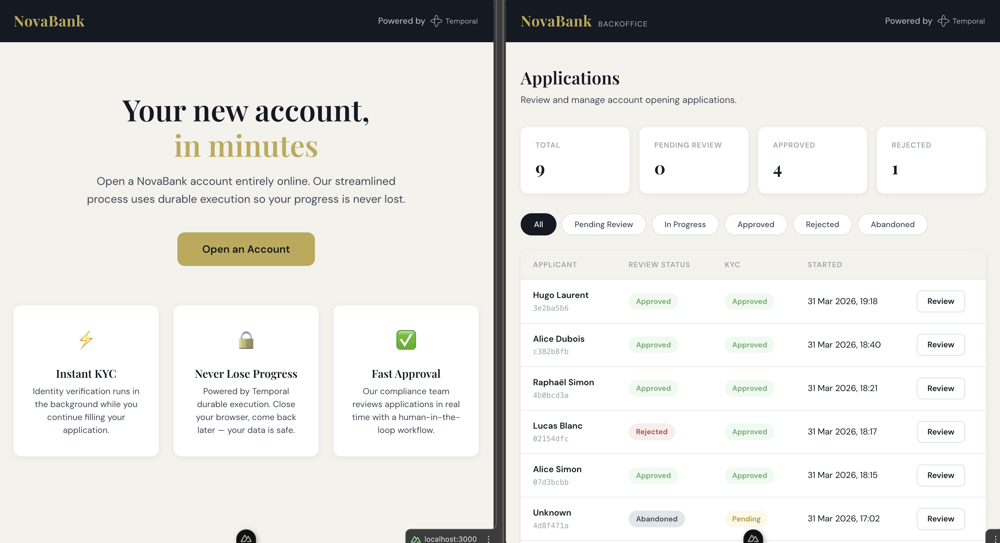
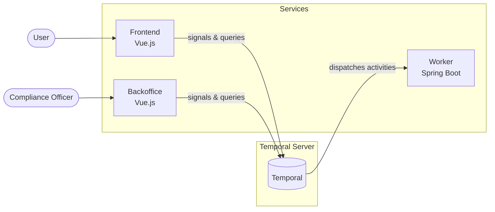

# Temporal NovaBank Demo

Multi-step account opening form for **NovaBank** (fictional bank),
powered by Temporal durable execution as the sole source of state
(no database). A demo/reference application showcasing Temporal
workflows with a human-in-the-loop pattern.



## Why Temporal?

This app deliberately avoids a traditional database. Temporal's
durable execution engine handles state, retries, timeouts, and
coordination — replacing what would otherwise require a database,
a job scheduler, and a lot of glue code.

- **User closes browser mid-form.** The workflow keeps all form
  state durably. The user can return hours later and resume
  exactly where they left off — no session store needed.
- **Server crashes during KYC check.** Temporal automatically
  retries the activity with backoff. The workflow picks up right
  where it left off, and the user never knows anything happened.
- **Compliance review takes days.** The workflow waits
  indefinitely for the human approval signal. No polling, no
  cron jobs, no expiring tokens — just a sleeping workflow that
  costs nothing until the officer acts.
- **Abandonment detection.** A built-in 3-minute timer resets on
  every form interaction. If the user goes idle, the workflow
  cancels itself automatically — no external scheduler required.

## Architecture

Monorepo with 3 independent components coordinated only through
Temporal:

| Component | Stack | Port |
| --------- | ----- | ---- |
| **frontend/** | Vue.js, Temporal TypeScript SDK | `localhost:3000` |
| **backoffice/** | Vue.js, Temporal TypeScript SDK | `localhost:3001` |
| **worker/** | Java, Spring Boot, Temporal Java SDK | — |



## Workflow

`AccountApplicationWorkflow` — entity workflow holding all form
state durably.

- **Signals** — `submitPage1–3()`, `submitFinalForm()`,
  `submitReviewDecision()`, `goToPage()`
- **Query** — `getFormState()` returns current page, status,
  form data, KYC info
- **Child workflow** — KYC verification runs in background
  during form filling
- **Timer** — 3-min abandonment timeout (resettable on form
  activity)
- **Human-in-the-loop** — compliance officer approves/rejects
  via backoffice

Search attributes: `ReviewStatus` (Keyword), `KycStatus`
(Keyword), `ApplicantName` (Text).

## Prerequisites

- Node.js
- Java (JDK)
- Temporal CLI (`temporal`)
- Docker and Docker Compose (for Docker setup)

## Local Development

Requires 4 terminals.

**Terminal 1** — Start Temporal dev server:

```bash
temporal server start-dev \
  --search-attribute "ReviewStatus=Keyword" \
  --search-attribute "KycStatus=Keyword" \
  --search-attribute "ApplicantName=Text"
```

**Terminal 2** — Start the Java worker:

```bash
cd worker
./mvnw spring-boot:run
```

**Terminal 3** — Start the frontend:

```bash
cd frontend
npm install
npm run dev
```

**Terminal 4** — Start the backoffice:

```bash
cd backoffice
npm install
npm run dev
```

| Service | URL |
| ------- | --- |
| Frontend | http://localhost:3000 |
| Backoffice | http://localhost:3001 |
| Temporal UI | http://localhost:8233 |

## Docker Compose

A `compose.yml` at the project root defines all services:
temporal (dev server), worker, frontend, backoffice.

Start:

```bash
docker-compose up --build
```

Stop:

```bash
docker-compose down
```

The same URLs apply (localhost:3000, localhost:3001,
localhost:8233).

## Debugging

- Use `temporal workflow show|query|signal|stack` to inspect
  workflows via CLI.
- Each form page has an "Auto-fill demo data" button for quick
  testing.

## License

This project is licensed under the Apache License 2.0.
See [LICENSE](LICENSE) for details.
